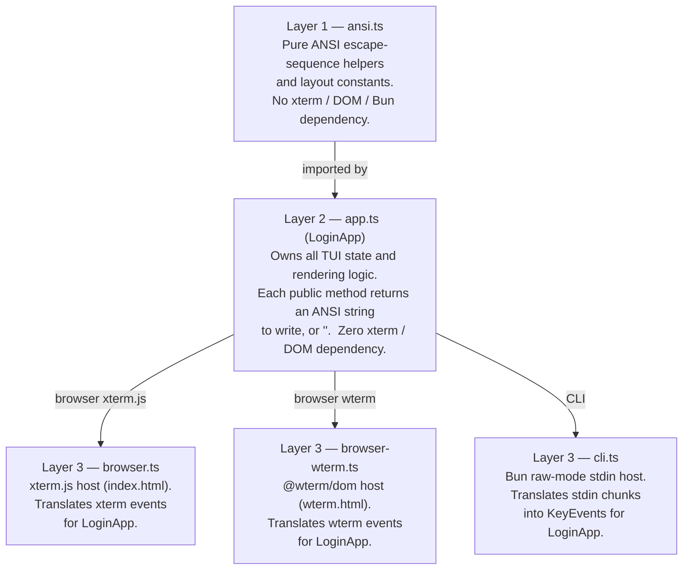

# login-tui

A fully-interactive TUI login form written in TypeScript.  
Runs in **three modes** from the same core logic:

| Mode | Host | How to run |
|------|------|-----------|
| Browser (xterm.js) | xterm.js via `index.html` | `bun dev` |
| Browser (wterm) | @wterm/dom via `wterm.html` | `bun dev:wterm` |
| Terminal (CLI) | Bun raw-mode stdin | `bun cli.ts` |

---

## Architecture

The code is split into three layers so that all rendering logic is completely
decoupled from the runtime environment:



### Files

| File | Purpose |
|------|---------|
| `ansi.ts` | ANSI escape helpers (`goto`, `cls`, `bold`, `rev`, `fg`, …) and box layout constants |
| `app.ts` | `LoginApp` class — all state and rendering, runtime-agnostic |
| `browser.ts` | xterm.js host wired to `LoginApp` (served via `index.html`) |
| `browser-wterm.ts` | @wterm/dom host wired to `LoginApp` (served via `wterm.html`) |
| `cli.ts` | Bun raw-mode CLI host wired to `LoginApp` |
| `index.html` | Entry point for the xterm.js browser mode |
| `wterm.html` | Entry point for the @wterm/dom browser mode |
| `package.json` | Dependencies and scripts |

---

## Usage

### Browser mode (xterm.js)

Requires [Bun](https://bun.sh) ≥ 1.0.

```bash
bun install
bun dev
```

Open <http://localhost:3000/> in any modern browser.

### Browser mode (wterm)

```bash
bun install
bun dev:wterm
```

Open <http://localhost:3000/> in any modern browser.

### CLI mode

```bash
bun cli.ts
```

Requires a real TTY (raw mode).  Press **Ctrl-C** or **Ctrl-D** to exit.

### Build

```bash
# Browser bundle (xterm.js)
bun run build:web

# Browser bundle (wterm)
bun run build:web:wterm

# Standalone CLI binary
bun run build:cli
```

---

## Controls

| Action | Keyboard | Mouse |
|--------|----------|-------|
| Move focus forward | `Tab` / `↓` | Click field or button |
| Move focus backward | `Shift-Tab` / `↑` | — |
| Type into field | Any printable key | — |
| Delete last character | `Backspace` | — |
| Confirm / activate | `Enter` | Click **Login** / **Cancel** |
| Reset after submit | `R` | — |
| Quit (CLI only) | `Ctrl-C` / `Ctrl-D` | — |

Focus order: **Username → Password → Login → Cancel** (wraps).

---

## Features

- Centered box that **reflows on terminal resize** (browser and CLI)
- **Password masking** — input echoed as `*`
- **SGR mouse tracking** — click to focus any field or button
- Inline **validation messages** (missing username / password)
- Success banner on login; press `R` to reset the form
- Pure ANSI rendering — no canvas, no DOM manipulation outside xterm
