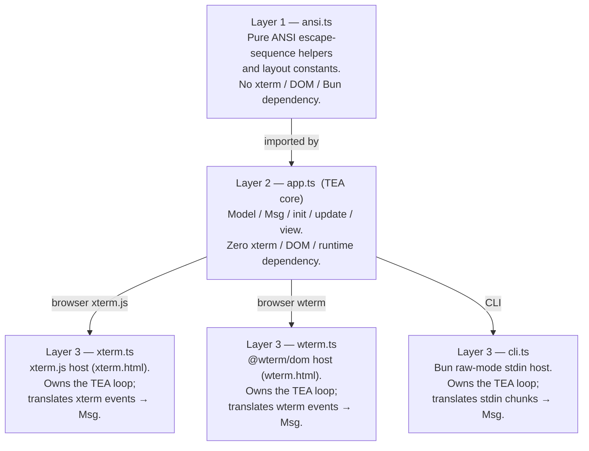

# login-tui

**Live demos →** [xterm.js version](./xterm.html) · [wterm version](./wterm.html)

A fully-interactive TUI login form written in TypeScript.  
Runs in **three modes** from the same core logic:

| Mode | Host | How to run |
|------|------|-----------|
| Browser (xterm.js) | xterm.js via `xterm.html` | `bun dev:xterm` |
| Browser (wterm) | @wterm/dom via `wterm.html` | `bun dev:wterm` |
| Terminal (CLI) | Bun raw-mode stdin | `bun dev:cli` |

---

## Architecture

The app is built on **The Elm Architecture (TEA)** and split into three layers so that all
rendering logic is completely decoupled from the runtime environment.

### The Elm Architecture

```
┌─────────────────────────────────────────────────────────┐
│                      TEA loop (host)                    │
│                                                         │
│   event ──► dispatch(msg) ──► update(msg, model)        │
│                                         │               │
│                                         ▼               │
│                               model' ──► view(model')   │
│                                                │        │
│                                                ▼        │
│                                           terminal.write│
└─────────────────────────────────────────────────────────┘
```

| TEA concept | Implementation in `app.ts` |
|-------------|---------------------------|
| **Model**   | `Model` interface — plain data record holding all app state |
| **Msg**     | `Msg` discriminated union — `Resize \| MousePress \| Key` |
| **init**    | `init(cols, rows): Model` — returns the initial model |
| **update**  | `update(msg, model): Model` — pure function; returns the same reference when nothing changes |
| **view**    | `view(model): string` — pure function that produces the full ANSI frame |

Each host file owns a tiny `dispatch` loop:

```ts
let model = init(cols, rows);
terminal.write(SGR_MOUSE_ENABLE + view(model));

function dispatch(msg: Msg): void {
  const next = update(msg, model);
  if (next === model) return;   // nothing changed → skip re-render
  model = next;
  terminal.write(view(model));
}
```

### Layers



### Files

| File | Purpose |
|------|---------|
| `ansi.ts` | ANSI escape helpers (`goto`, `cls`, `bold`, `rev`, `fg`, …) and box layout constants |
| `app.ts` | TEA core — `Model`, `Msg`, `init`, `update`, `view`; runtime-agnostic |
| `xterm.ts` | xterm.js host; owns the TEA loop (served via `xterm.html`) |
| `wterm.ts` | @wterm/dom host; owns the TEA loop (served via `wterm.html`) |
| `cli.ts` | Bun raw-mode CLI host; owns the TEA loop |
| `xterm.html` | Entry point for the xterm.js browser mode |
| `wterm.html` | Entry point for the @wterm/dom browser mode |
| `package.json` | Dependencies and scripts |

---

## Usage

### Browser mode (xterm.js)

Requires [Bun](https://bun.sh) ≥ 1.0.

```bash
bun install
bun dev:xterm
```

Open <http://localhost:3000/> in any modern browser.

### Browser mode (wterm)

```bash
bun install
bun dev:wterm
```

Open <http://localhost:3000/> in any modern browser.

### CLI mode

```bash
bun dev:cli
```

Requires a real TTY (raw mode).  Press **Ctrl-C** or **Ctrl-D** to exit.

### Build

```bash
# Browser bundle (xterm.js)
bun run build:xterm

# Browser bundle (wterm)
bun run build:wterm

# Standalone CLI binary
bun run build:cli
```

---

## Controls

| Action | Keyboard | Mouse |
|--------|----------|-------|
| Move focus forward | `Tab` / `↓` | Click field or button |
| Move focus backward | `Shift-Tab` / `↑` | — |
| Type into field | Any printable key | — |
| Delete last character | `Backspace` | — |
| Confirm / activate | `Enter` | Click **Login** / **Cancel** |
| Reset after submit | `R` | — |
| Quit (CLI only) | `Ctrl-C` / `Ctrl-D` | — |

Focus order: **Username → Password → Login → Cancel** (wraps).

---

## Features

- Centered box that **reflows on terminal resize** (browser and CLI)
- **Password masking** — input echoed as `*`
- **SGR mouse tracking** — click to focus any field or button
- Inline **validation messages** (missing username / password)
- Success banner on login; press `R` to reset the form
- Pure ANSI rendering — no canvas, no DOM manipulation outside xterm
