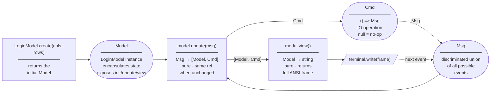
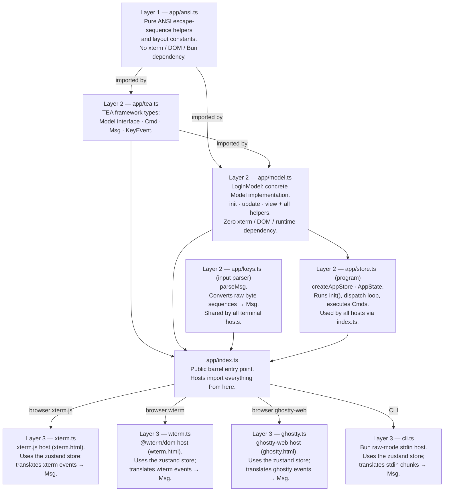

# login-tui

A fully-interactive TUI login form written in TypeScript.  
Runs in **four modes** from the same core logic:

| Mode | Host | How to run |
|------|------|-----------|
| Browser (xterm.js) | xterm.js via `xterm.html` | `bun dev:xterm` |
| Browser (wterm) | @wterm/dom via `wterm.html` | `bun dev:wterm` |
| Browser (ghostty-web) | ghostty-web via `ghostty.html` | `bun dev:ghostty` |
| Terminal (CLI) | Bun raw-mode stdin | `bun dev:cli` |

---

## Architecture

The app is built on **The Elm Architecture (TEA)** and split into three layers so that all
rendering logic is completely decoupled from the runtime environment.

### The Elm Architecture

The implementation follows bubbletea's `tea.Model` interface exactly:



| TEA concept | bubbletea (Go) | Implementation in `app/` |
|-------------|----------------|--------------------------|
| **Model**   | `type Model interface { Init() Cmd; Update(Msg) (Model, Cmd); View() View }` | `interface Model` in `app/tea.ts` — `LoginModel` class in `app/model.ts` |
| **Msg**     | `type Msg = any` | `app/tea.ts` — `Msg` discriminated union — `Resize \| MousePress \| Key` |
| **Cmd**     | `type Cmd func() Msg` | `app/tea.ts` — `type Cmd = (() => Msg \| Promise<Msg>) \| null` |
| **init**    | `func (m model) Init() tea.Cmd` | `LoginModel.create(cols, rows)` constructs the initial model; `init()` returns null |
| **update**  | `func (m model) Update(msg tea.Msg) (tea.Model, tea.Cmd)` | `model.update(msg): [Model, Cmd]` — returns same reference when nothing changes |
| **view**    | `func (m model) View() tea.View` | `model.view(): string` — pure function that produces the full ANSI frame |
| **program** | `tea.NewProgram(model{})` | `createAppStore(initialModel)` in `app/store.ts` — runs `init()`, dispatch loop, and executes Cmds |

Each host creates a store and subscribes for rendering:

```ts
const { store, dispatch } = createAppStore(LoginModel.create(cols, rows));

// Enable SGR mouse tracking + first frame
terminal.write(SGR_MOUSE_ENABLE + store.getState().model.view());

// Re-render whenever the model changes
store.subscribe((state, prev) => {
  if (state.model !== prev.model) terminal.write(state.model.view());
});
```

### Layers



### Files

| File | Purpose |
|------|---------|
| `app/ansi.ts` | ANSI escape helpers (`goto`, `cls`, `bold`, `rev`, `fg`, …) and box layout constants |
| `app/tea.ts` | TEA framework types — `Model` interface, `Cmd`, `Msg` (event union), `KeyEvent` |
| `app/model.ts` | `LoginModel` — concrete `Model` implementation; encapsulates state and implements `init()`, `update()`, `view()` |
| `app/store.ts` | `createAppStore(initialModel)` — zustand vanilla store (the "program"); calls `init()`, runs the dispatch loop, executes Cmds |
| `app/keys.ts` | Shared input parser — `parseMsg`; used by all hosts |
| `app/geom.ts` | Internal geometry helpers shared by `model.ts` update and view logic (not in public API) |
| `app/index.ts` | Public barrel entry point — hosts import everything from here |
| `xterm.ts` | xterm.js host; uses the zustand store (served via `xterm.html`) |
| `wterm.ts` | @wterm/dom host; uses the zustand store (served via `wterm.html`) |
| `ghostty.ts` | ghostty-web host; uses the zustand store (served via `ghostty.html`) |
| `cli.ts` | Bun raw-mode CLI host; uses the zustand store |
| `xterm.html` | Entry point for the xterm.js browser mode |
| `wterm.html` | Entry point for the @wterm/dom browser mode |
| `ghostty.html` | Entry point for the ghostty-web browser mode |
| `package.json` | Dependencies and scripts |

---

## Usage

### Dev

```bash
bun xterm.html    # browser (xterm.js)
bun wterm.html    # browser (wterm)
bun ghostty.html  # browser (ghostty-web)
bun cli.ts        # CLI (requires TTY; Ctrl-C / Ctrl-D to exit)
```

Open http://localhost:3000/ for browser modes.

### Build

```bash
bun build:xterm    # browser (xterm.js)
bun build:wterm    # browser (wterm)
bun build:ghostty  # browser (ghostty-web)
bun build:cli      # standalone CLI
make build         # everything above
```

Outputs are written to `dist/` (HTML entry points, hashed JS/CSS assets, and the standalone `cli` binary).

---

## Controls

| Action | Keyboard | Mouse |
|--------|----------|-------|
| Move focus forward | `Tab` / `↓` | Click field or button |
| Move focus backward | `Shift-Tab` / `↑` | — |
| Type into field | Any printable key | — |
| Delete last character | `Backspace` | — |
| Confirm / activate | `Enter` | Click **Login** / **Cancel** |
| Reset after submit | `R` | — |
| Quit (CLI only) | `Ctrl-C` / `Ctrl-D` | — |

Focus order: **Username → Password → Login → Cancel** (wraps).

---

## Features

- Centered box that **reflows on terminal resize** (browser and CLI)
- **Password masking** — input echoed as `*`
- **SGR mouse tracking** — click to focus any field or button
- Inline **validation messages** (missing username / password)
- Success banner on login; press `R` to reset the form
- Pure ANSI rendering — no canvas, no DOM manipulation outside xterm
