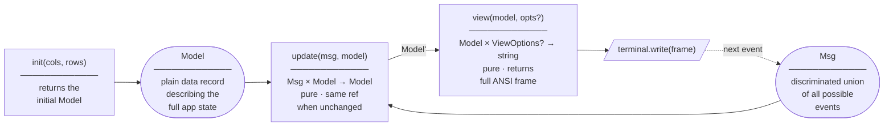
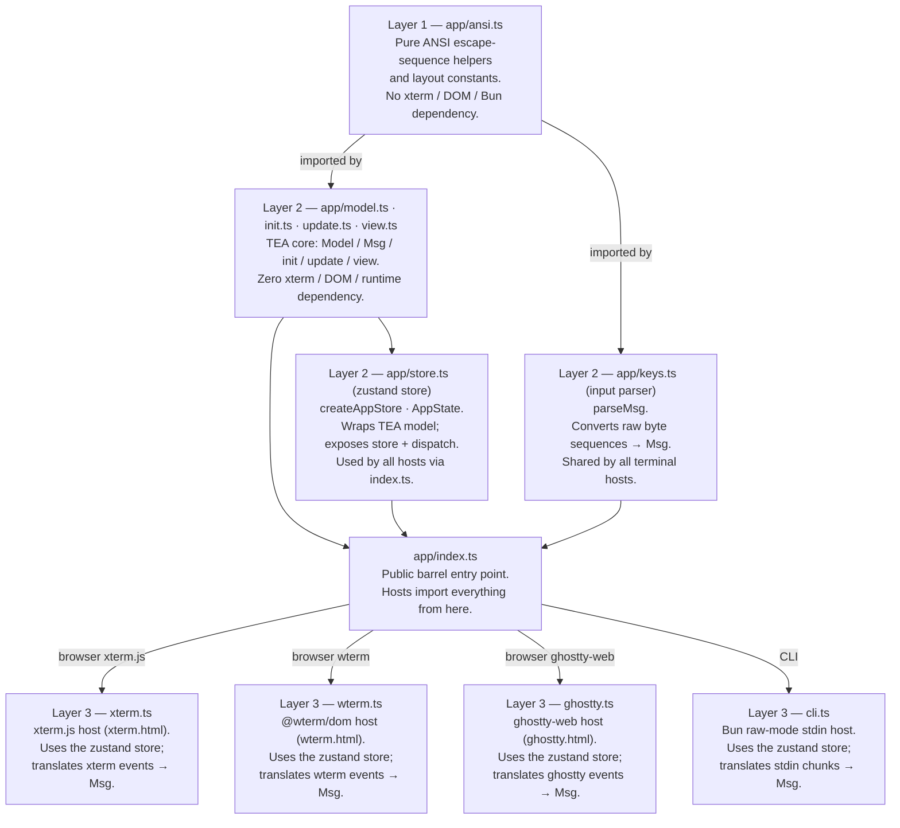

# login-tui

A fully-interactive TUI login form written in TypeScript.  
Runs in **four modes** from the same core logic:

| Mode | Host | How to run |
|------|------|-----------|
| Browser (xterm.js) | xterm.js via `xterm.html` | `bun dev:xterm` |
| Browser (wterm) | @wterm/dom via `wterm.html` | `bun dev:wterm` |
| Browser (ghostty-web) | ghostty-web via `ghostty.html` | `bun dev:ghostty` |
| Terminal (CLI) | Bun raw-mode stdin | `bun dev:cli` |

---

## Architecture

The app is built on **The Elm Architecture (TEA)** and split into three layers so that all
rendering logic is completely decoupled from the runtime environment.

### The Elm Architecture



| TEA concept | Implementation in `app/` |
|-------------|--------------------------|
| **Model**   | `app/model.ts` — `Model` interface, plain data record holding all app state |
| **Msg**     | `app/model.ts` — `Msg` discriminated union — `Resize \| MousePress \| Key` |
| **init**    | `app/init.ts` — `init(cols, rows): Model` — returns the initial model |
| **update**  | `app/update.ts` — `update(msg, model): Model` — pure function; returns the same reference when nothing changes |
| **view**    | `app/view.ts` — `view(model, opts?): string` — pure function that produces the full ANSI frame; pass `{ enableMouse: true }` on the first call to prefix the SGR mouse-enable sequence |
| **store**   | `app/store.ts` — `createAppStore(cols, rows)` — zustand vanilla store; returns `{ store, dispatch }` so hosts subscribe for rendering without managing model state directly |

Each host creates a zustand store and subscribes for rendering:

```ts
const { store, dispatch } = createAppStore(cols, rows);
terminal.write(view(store.getState().model, { enableMouse: true }));  // first frame enables mouse tracking

// Re-render whenever the model changes
store.subscribe((state, prev) => {
  if (state.model !== prev.model) terminal.write(view(state.model));
});
```

### Layers



### Files

| File | Purpose |
|------|---------|
| `app/ansi.ts` | ANSI escape helpers (`goto`, `cls`, `bold`, `rev`, `fg`, …) and box layout constants |
| `app/model.ts` | TEA types — `Model` (state record), `KeyEvent`, `Msg` (event union) |
| `app/init.ts` | TEA `init(cols, rows): Model` — returns the initial model |
| `app/update.ts` | TEA `update(msg, model): Model` — pure state transition; all input logic |
| `app/view.ts` | TEA `view(model): string` — pure ANSI frame renderer |
| `app/store.ts` | Zustand vanilla store — `createAppStore(cols, rows)` returns `{ store, dispatch }`; centralises model state and change-detection for all hosts |
| `app/keys.ts` | Shared input parser — `parseMsg`; used by all hosts |
| `app/geom.ts` | Internal geometry helpers shared by `update` and `view` (not in public API) |
| `app/index.ts` | Public barrel entry point — hosts import everything from here |
| `xterm.ts` | xterm.js host; uses the zustand store (served via `xterm.html`) |
| `wterm.ts` | @wterm/dom host; uses the zustand store (served via `wterm.html`) |
| `ghostty.ts` | ghostty-web host; uses the zustand store (served via `ghostty.html`) |
| `cli.ts` | Bun raw-mode CLI host; uses the zustand store |
| `xterm.html` | Entry point for the xterm.js browser mode |
| `wterm.html` | Entry point for the @wterm/dom browser mode |
| `ghostty.html` | Entry point for the ghostty-web browser mode |
| `package.json` | Dependencies and scripts |

---

## Usage

### Dev

```bash
bun xterm.html    # browser (xterm.js)
bun wterm.html    # browser (wterm)
bun ghostty.html  # browser (ghostty-web)
bun cli.ts        # CLI (requires TTY; Ctrl-C / Ctrl-D to exit)
```

Open http://localhost:3000/ for browser modes.

### Build

```bash
bun build:xterm    # browser (xterm.js)
bun build:wterm    # browser (wterm)
bun build:ghostty  # browser (ghostty-web)
bun build:cli      # standalone CLI
make build         # everything above
```

Outputs are written to `dist/` (HTML entry points, hashed JS/CSS assets, and the standalone `cli` binary).

---

## Controls

| Action | Keyboard | Mouse |
|--------|----------|-------|
| Move focus forward | `Tab` / `↓` | Click field or button |
| Move focus backward | `Shift-Tab` / `↑` | — |
| Type into field | Any printable key | — |
| Delete last character | `Backspace` | — |
| Confirm / activate | `Enter` | Click **Login** / **Cancel** |
| Reset after submit | `R` | — |
| Quit (CLI only) | `Ctrl-C` / `Ctrl-D` | — |

Focus order: **Username → Password → Login → Cancel** (wraps).

---

## Features

- Centered box that **reflows on terminal resize** (browser and CLI)
- **Password masking** — input echoed as `*`
- **SGR mouse tracking** — click to focus any field or button
- Inline **validation messages** (missing username / password)
- Success banner on login; press `R` to reset the form
- Pure ANSI rendering — no canvas, no DOM manipulation outside xterm
