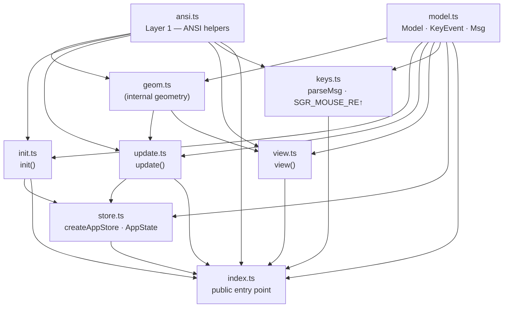

# `./app` — Core Module

This directory contains the entire runtime-agnostic core of login-tui.
Host files (`cli.ts`, `xterm.ts`, `wterm.ts`) **only import from `./app/index.ts`** —
they never reach into the internal files directly.

---

## Public API

```ts
import {
  // TEA types
  type Model, type KeyEvent, type Msg,
  // TEA functions
  init, update, view, type ViewOptions,
  // Input parser
  parseMsg,
  // ANSI utilities for host lifecycle management
  showCursor, cls, SGR_MOUSE_DISABLE,
  // Zustand store factory
  createAppStore, type AppState,
} from './app/index.ts';
```

---

## Module Responsibilities

### Layer 1 — ANSI primitives

| File | Responsibility |
|------|---------------|
| `ansi.ts` | Pure ANSI escape-sequence helpers (`goto`, `cls`, `bold`, `rev`, `fg`, …), box layout constants (`BOX_W`, `BOX_H`, `INPUT_W`, `INNER`, …), and **SGR mouse protocol constants** (`SGR_MOUSE_ENABLE`, `SGR_MOUSE_RE`). Both directions of the SGR mouse protocol (output enable sequence and the input-parsing regex) live here together. No dependencies. |

### Layer 2 — TEA core + input parser

| File | TEA role | Responsibility |
|------|----------|---------------|
| `model.ts` | **Model / Msg** | Plain TypeScript types only: `Model` (app state record), `KeyEvent` (keyboard event interface), `Msg` (discriminated union of all events). Zero runtime code. |
| `init.ts` | **init** | `init(cols, rows): Model` — returns the initial `Model` for a given terminal size. |
| `update.ts` | **update** | `update(msg, model): Model` — pure state-transition function. Returns the same reference when nothing changes, enabling cheap re-render guards. Contains all input-handling logic (`_handleKey`, `_handleMousePress`, `_activateFocus`, `_hitTest`). |
| `view.ts` | **view** | `view(model, opts?): string` — pure render function. Accepts optional `ViewOptions { enableMouse?: boolean }`: when `enableMouse: true` the returned string is prefixed with `SGR_MOUSE_ENABLE`, so hosts never need to import or know that escape sequence directly. All rendering helpers live here. |
| `store.ts` | **store** | `createAppStore(cols, rows)` — creates a [zustand](https://github.com/pmndrs/zustand) vanilla store that holds the TEA model. Returns `{ store, dispatch }`: `store` is a `StoreApi<AppState>` hosts subscribe to for rendering; `dispatch` is a stable closure outside store state that runs `update` and calls `store.setState` only when the model reference changes. |
| `keys.ts` | *(shared)* | Raw terminal byte-sequence parser used by all hosts. Exports only `parseMsg(data): Msg \| null`. Imports `SGR_MOUSE_RE` from `ansi.ts`; the SGR protocol constants are **not** re-exported here. |
| `geom.ts` | *(internal)* | Geometry helpers shared by `update.ts` and `view.ts`: `layout(model)` computes the centred box origin; `inputVW` / `btnVW` compute widget visual widths for both hit-testing and rendering. **Not exported from `index.ts`.** |

### Entry point

| File | Responsibility |
|------|---------------|
| `index.ts` | Barrel re-export. The single public surface of the `./app` module. Hosts import everything from here; the internal file layout is an implementation detail. |

---

## Dependency graph



---

## Design notes

### High cohesion, low coupling

All TEA roles (`Model`, `init`, `update`, `view`) and shared utilities (`keys`, `ansi`)
are co-located in this directory. Host files have **zero knowledge** of the internal
split — they import from a single barrel entry point and the module can be
freely reorganised without touching any host.

### Pure functions only

`init`, `update`, and `view` have no side-effects and no I/O dependencies.
`update` returns the **same object reference** when nothing changed.
`app/store.ts` exploits this: the `dispatch` closure applies the strict-equality guard
(`if (next !== model) store.setState(…)`) once, centrally, so no host needs to replicate it.

### The dispatch loop (created by `createAppStore`, used by each host)

`app/store.ts` encapsulates the dispatch loop in a [zustand](https://github.com/pmndrs/zustand)
vanilla store so hosts don't manage model state directly:

```ts
const { store, dispatch } = createAppStore(cols, rows);
terminal.write(view(store.getState().model, { enableMouse: true }));  // first frame enables mouse tracking

// Re-render whenever the model changes
store.subscribe((state, prev) => {
  if (state.model !== prev.model) terminal.write(view(state.model));
});
```

`dispatch` is a stable closure outside the store state. It runs the pure `update` function
and calls `store.setState` only when the model reference changes — the same guard as
before, but now centralised so no host needs to replicate it.

### Why `xterm.ts` mixes `onData` and `onKey`

xterm.js delivers keyboard events on two channels:
- `onKey({ key, domEvent })` — decoded keyboard event with the full `KeyboardEvent` (shift/ctrl/alt flags all set correctly)
- `onData(raw)` — raw byte sequences, which include **mouse** SGR sequences

Using `onKey` for keyboard gives better fidelity than re-parsing raw bytes. Mouse events still arrive as raw SGR sequences through `onData`, so `parseMsg` is used there filtered to `MousePress` only:

```ts
term.onData(data => {
  const msg = parseMsg(data);
  if (msg?.type === 'MousePress') dispatch(msg);  // only mouse; keyboard comes via onKey
});
term.onKey(({ key, domEvent }) => {
  dispatch({ type: 'Key', key, event: domEvent });
});
```
