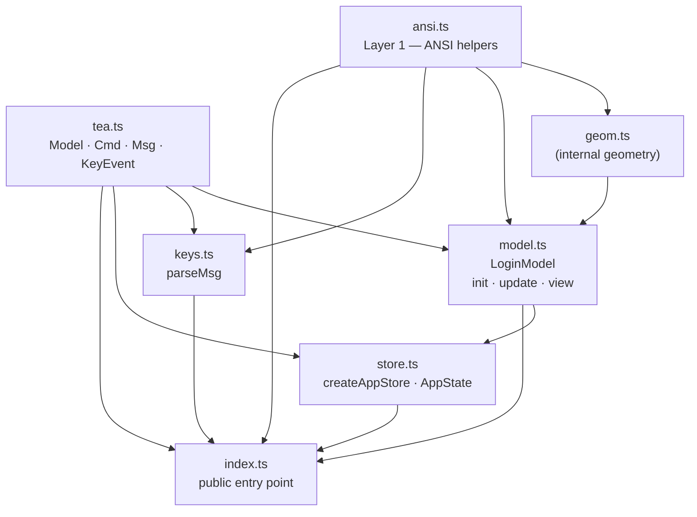

# `./app` — Core Module

This directory contains the entire runtime-agnostic core of login-tui.
Host files (`cli.ts`, `xterm.ts`, `wterm.ts`) **only import from `./app/index.ts`** —
they never reach into the internal files directly.

---

## Public API

```ts
import {
  // TEA framework types
  type Model, type Cmd, type Msg, type KeyEvent,
  // Concrete model (create initial instance here)
  LoginModel,
  // Input parser
  parseMsg,
  // ANSI utilities for host lifecycle management
  showCursor, cls, SGR_MOUSE_ENABLE, SGR_MOUSE_DISABLE,
  // Zustand store factory
  createAppStore, type AppState,
} from './app/index.ts';
```

---

## Module Responsibilities

### Layer 1 — ANSI primitives

| File | Responsibility |
|------|---------------|
| `ansi.ts` | Pure ANSI escape-sequence helpers (`goto`, `cls`, `bold`, `rev`, `fg`, …), box layout constants (`BOX_W`, `BOX_H`, `INPUT_W`, `INNER`, …), and **SGR mouse protocol constants** (`SGR_MOUSE_ENABLE`, `SGR_MOUSE_RE`). Both directions of the SGR mouse protocol (output enable sequence and the input-parsing regex) live here together. No dependencies. |

### Layer 2 — TEA core + input parser

| File | TEA role | Responsibility |
|------|----------|---------------|
| `tea.ts` | **Framework types** | `KeyEvent`, `Msg` (discriminated union of all events), `Cmd` (`() => Msg \| Promise<Msg>` or `null`), and the `Model` interface (`init / update / view`). Analogous to charm.land/bubbletea/v2's `tea.Model`, `tea.Cmd`, and `tea.Msg`. |
| `model.ts` | **Model** | `LoginModel` — concrete implementation of `Model`. Encapsulates all application state (`LoginState`) and exposes three methods: `init()`, `update(msg)`, and `view()`. Replaces the old standalone `init.ts`, `update.ts`, and `view.ts` files. All update and render helpers are private to this module. |
| `store.ts` | **Program** | `createAppStore(initialModel)` — analogous to `tea.NewProgram`. Creates a [zustand](https://github.com/pmndrs/zustand) vanilla store, calls `initialModel.init()` for the startup Cmd, and provides a `dispatch` closure that runs `model.update()` and executes any returned `Cmd`. |
| `keys.ts` | *(shared)* | Raw terminal byte-sequence parser used by all hosts. Exports only `parseMsg(data): Msg \| null`. Imports `SGR_MOUSE_RE` from `ansi.ts`. |
| `geom.ts` | *(internal)* | Geometry helpers shared by `model.ts` update and view logic: `layout({ cols, rows })` computes the centred box origin; `inputVW` / `btnVW` compute widget visual widths for both hit-testing and rendering. **Not exported from `index.ts`.** |

### Entry point

| File | Responsibility |
|------|---------------|
| `index.ts` | Barrel re-export. The single public surface of the `./app` module. Hosts import everything from here; the internal file layout is an implementation detail. |

---

## Dependency graph



---

## Design notes

### Authentic Elm Architecture

`LoginModel` mirrors the bubbletea `tea.Model` interface exactly:

| bubbletea (Go) | This module (TypeScript) |
|----------------|--------------------------|
| `type Model interface { Init() Cmd; Update(Msg) (Model, Cmd); View() View }` | `interface Model { init(): Cmd; update(msg: Msg): [Model, Cmd]; view(): string }` |
| `type Cmd func() Msg` | `type Cmd = (() => Msg \| Promise<Msg>) \| null` |
| model struct with value-receiver methods | `LoginModel` class with immutable state (`LoginState`) |

`update()` returns `[Model, Cmd]` — the new model **and** an optional IO command —
matching bubbletea's `Update(Msg) (tea.Model, tea.Cmd)` exactly.

### Pure functions only

`update()` and `view()` have no side-effects and no I/O dependencies.
`update()` returns the **same object reference** when nothing changed —
`store.ts` exploits this to guard `setState` calls and skip unnecessary re-renders.

### The dispatch loop (created by `createAppStore`, used by each host)

`app/store.ts` encapsulates the dispatch loop (analogous to `tea.Program.Run`):

```ts
const { store, dispatch } = createAppStore(LoginModel.create(cols, rows));

// Enable SGR mouse tracking + first frame
terminal.write(SGR_MOUSE_ENABLE + store.getState().model.view());

// Re-render whenever the model changes
store.subscribe((state, prev) => {
  if (state.model !== prev.model) terminal.write(state.model.view());
});
```

`dispatch` is a stable closure outside the store state. It runs `model.update(msg)`,
calls `store.setState` only when the model reference changes, and automatically
executes any `Cmd` returned by `update()`.

### Why `xterm.ts` mixes `onData` and `onKey`

xterm.js delivers keyboard events on two channels:
- `onKey({ key, domEvent })` — decoded keyboard event with the full `KeyboardEvent` (shift/ctrl/alt flags all set correctly)
- `onData(raw)` — raw byte sequences, which include **mouse** SGR sequences

Using `onKey` for keyboard gives better fidelity than re-parsing raw bytes. Mouse events still arrive as raw SGR sequences through `onData`, so `parseMsg` is used there filtered to `MousePress` only:

```ts
term.onData(data => {
  const msg = parseMsg(data);
  if (msg?.type === 'MousePress') dispatch(msg);  // only mouse; keyboard comes via onKey
});
term.onKey(({ key, domEvent }) => {
  dispatch({ type: 'Key', key, event: domEvent });
});
```

