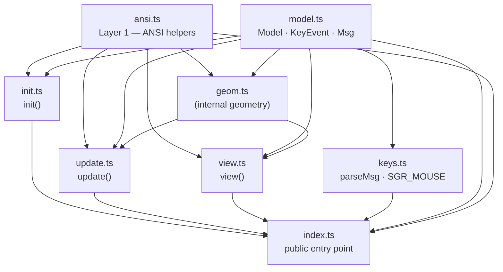

# `./app` — Core Module

This directory contains the entire runtime-agnostic core of login-tui.
Host files (`cli.ts`, `xterm.ts`, `wterm.ts`) **only import from `./app/index.ts`** —
they never reach into the internal files directly.

---

## Public API

```ts
import {
  // TEA types
  type Model, type KeyEvent, type Msg,
  // TEA functions
  init, update, view,
  // Input parser
  SGR_MOUSE_ENABLE, SGR_MOUSE, parseMsg,
  // ANSI utilities
  showCursor, cls,
} from './app/index.ts';
```

---

## Module Responsibilities

### Layer 1 — ANSI primitives

| File | Responsibility |
|------|---------------|
| `ansi.ts` | Pure ANSI escape-sequence helpers (`goto`, `cls`, `bold`, `rev`, `fg`, …) and box layout constants (`BOX_W`, `BOX_H`, `INPUT_W`, `INNER`, …). No dependencies. |

### Layer 2 — TEA core + input parser

| File | TEA role | Responsibility |
|------|----------|---------------|
| `model.ts` | **Model / Msg** | Plain TypeScript types only: `Model` (app state record), `KeyEvent` (keyboard event interface), `Msg` (discriminated union of all events). Zero runtime code. |
| `init.ts` | **init** | `init(cols, rows): Model` — returns the initial `Model` for a given terminal size. |
| `update.ts` | **update** | `update(msg, model): Model` — pure state-transition function. Returns the same reference when nothing changes, enabling cheap re-render guards. Contains all input-handling logic (`_handleKey`, `_handleMousePress`, `_activateFocus`, `_hitTest`). |
| `view.ts` | **view** | `view(model): string` — pure render function that produces the full ANSI frame string. All rendering helpers (`_render`, `_renderInput`, `_renderBtn`, `_boxRow`, `_center`) live here. |
| `keys.ts` | *(shared)* | Raw terminal byte-sequence parser used by all hosts. Exports `SGR_MOUSE_ENABLE` (escape sequence to enable SGR mouse tracking), `SGR_MOUSE` (regex for SGR mouse events), and `parseMsg(data): Msg \| null`. |
| `geom.ts` | *(internal)* | Geometry helpers shared by `update.ts` and `view.ts`: `layout(model)` computes the centred box origin; `inputVW` / `btnVW` compute widget visual widths for both hit-testing and rendering. **Not exported from `index.ts`.** |

### Entry point

| File | Responsibility |
|------|---------------|
| `index.ts` | Barrel re-export. The single public surface of the `./app` module. Hosts import everything from here; the internal file layout is an implementation detail. |

---

## Dependency graph



---

## Design notes

### High cohesion, low coupling

All TEA roles (`Model`, `init`, `update`, `view`) and shared utilities (`keys`, `ansi`)
are co-located in this directory. Host files have **zero knowledge** of the internal
split — they import from a single barrel entry point and the module can be
freely reorganised without touching any host.

### Pure functions only

`init`, `update`, and `view` have no side-effects and no I/O dependencies.
`update` returns the **same object reference** when nothing changed, so hosts can
use a strict-equality guard (`if (next === model) return`) to skip unnecessary
re-renders.

### The dispatch loop (owned by each host)

```ts
let model = init(cols, rows);
terminal.write(SGR_MOUSE_ENABLE + view(model));

function dispatch(msg: Msg): void {
  const next = update(msg, model);
  if (next === model) return;   // nothing changed → skip re-render
  model = next;
  terminal.write(view(model));
}
```
